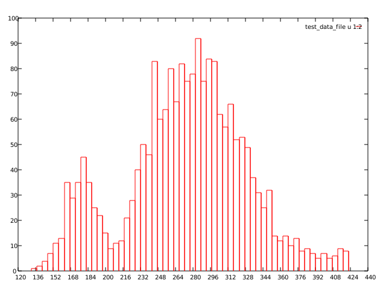
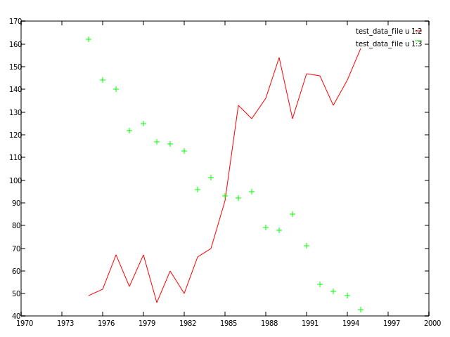
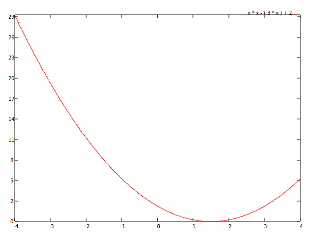
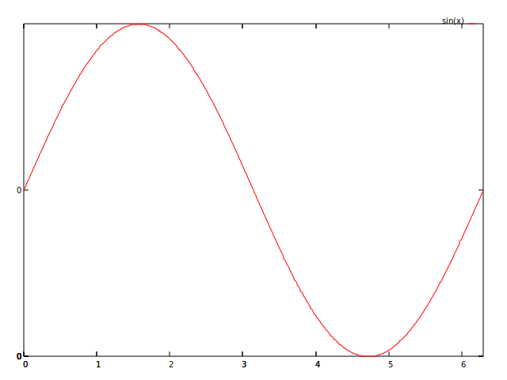

# go-plot

A Golang library with some Gnuplot features (in progress).
For more info on Gnuplot, visit [Gnuplot](http://gnuplot.info/)

### General features already working

1. Go package to generate plots from multiple sets of points;
2. creation of plots from data files;
3. creation of plots from mathematical functions (in development);
4. graphic drivers to generate the following output formats: SVG, HTML Canvas;
5. CLI interface to read plot files and generate the graphic output;

### GNU-Plot like commands already working

1. plot command ```set terminal [svg]```
2. plot command ```set output "file name"```
3. plot command ```plot "data file" using i:j with [dots/boxes/lines/linespoints/points] title "description"```
4. plot command ```plot [i:j] mathematical function```
5. plot command ```set xlabel "label"```
6. plot command ```set ylabel "label"```

### Additional features already working

1. REST API interface to receive plot commands and generate the graphic output (plot/svg endpoint);
2. REST API interface to receive plot commands and generate the graphic output (plot/canvas endpoint);

### Working samples

```
set terminal svg
set output "output.svg"

plot "data" using 1:2 with boxes
```



```
set terminal svg
set output "output.svg"

plot "data" using 1:2 with lines,
     "data" using 1:3
```



```
set terminal svg
set output "output.svg"

plot [-4:+4] x * x - 3 * x + 2
```



```
set terminal svg
set output "output.svg"

plot [0:6.283184] sin(x)
```


