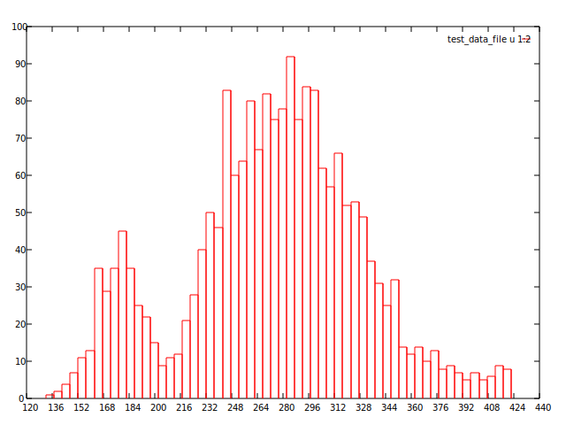
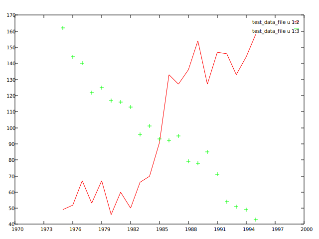

# go-plot

A Golang library with some Gnuplot features (in progress).
For more infor on Gnuplot, visit [Gnuplot](http://gnuplot.info/)

### General features working

1. CLI interface to read plot files and generate the graphic output;
2. graphic drivers to generate the following output formats: SVG;
3. creating plots from data files;
4. multiple data files combined in a single plot;
5. creating plots from mathematical functions (in development);

### GNU-Plot like commands working

1. plot command ```set terminal [svg]```
2. plot command ```set output "file name"```
3. plot command ```plot "data file" using i:j with [dots/boxes/lines/linespoints/points] title "description"```
4. plot command ```set xlabel "label"```
5. plot command ```set ylabel "label"```

### Additional features working

1. REST API interface to receive plot commands and generate the graphic output (in development);

### Working samples

```
set terminal svg
set output "output.svg"

plot "data" using 1:2 with boxes
```



```
set terminal svg
set output "output.svg"

plot "data" using 1:2 with lines,
     "data" using 1:3
```


