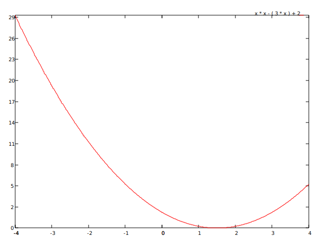

# go-plot

[](https://github.com/aldebap/go-plot/actions/workflows/go.yml)
[](https://github.com/aldebap/go-plot/actions/workflows/docker-image.yml)

A Golang library with some Gnuplot features (in progress).
For more info on Gnuplot, visit [Gnuplot](http://gnuplot.info/)

### General features already working

1. Go package to generate plots from multiple sets of points;
2. creation of plots from data files;
3. creation of plots from mathematical functions (in development);
4. graphic drivers to generate the following output formats: SVG, HTML Canvas, GIF, JPEG, PNG;
5. CLI interface to read plot files and generate the graphic output;

### GNU-Plot like commands already working

1. plot command ```set terminal [svg/canvas/gif/jpeg/png]```
2. plot command ```set output "file name"```
3. plot command ```plot "data file" using i:j with [dots/boxes/lines/linespoints/points] title "description"```
4. plot command ```plot [i:j] mathematical function```
5. plot command ```set xlabel "label"```
6. plot command ```set ylabel "label"```

### Additional features already working

1. REST API interface to receive plot commands and generate the graphic output (plot/svg endpoint);
2. REST API interface to receive plot commands and generate the graphic output (plot/canvas endpoint);
3. REST API interface to receive plot commands and generate the graphic output (plot/gif endpoint);
4. REST API interface to receive plot commands and generate the graphic output (plot/jpeg endpoint);
5. REST API interface to receive plot commands and generate the graphic output (plot/png endpoint);
6. Web interface to set plot configuration and generate dynamic plots through the canvas endpoint;
7. Dockerfile to serve Web interface and the REST API interface from a single container;

### Plot file samples

```gnuplot
set terminal svg
set output "output.svg"

plot "data" using 1:2 with boxes
```


```gnuplot
set terminal svg
set output "output.svg"

plot "data" using 1:2 with lines,
     "data" using 1:3
```


```gnuplot
set terminal svg
set output "output.svg"

plot [-4:+4] x * x - 3 * x + 2
```



```gnuplot
set terminal svg
set output "output.svg"

plot [0:6.283184] sin(x)
```


### Features backlog (for v1.0 release)

- [x] ~~Dataset upload button on Web Go-Plot;~~
- [ ] Github's Web Go-Plot package;
- [ ] help on how to run Web Go-Plot from Github's package;
- [ ] Webassembly version of Go-Plot for Web;
- [ ] configuration + generic test script;
- [ ] fix bug in multiple plot titles;
- [ ] signed literals in expression parser;
- [ ] assignment operator in function plots;
- [ ] parametric plots;
- [ ] refactor plot file parser;
- [ ] bug in scale evaluation;
- [ ] fix title positioning;
- [ ] rotate y axis for every driver;
- [ ] add more plot styles;
- [ ] add more colors to default pallete;
- [ ] colour pallete command;
- [ ] LaTeX driver;
- [ ] PDF driver;
- [ ] PS driver;
